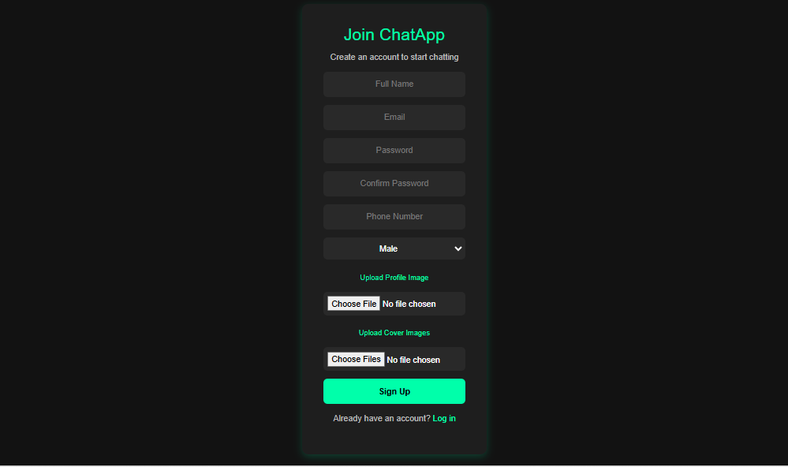
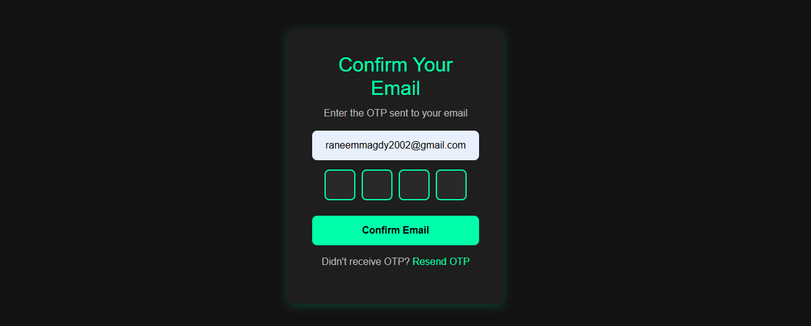
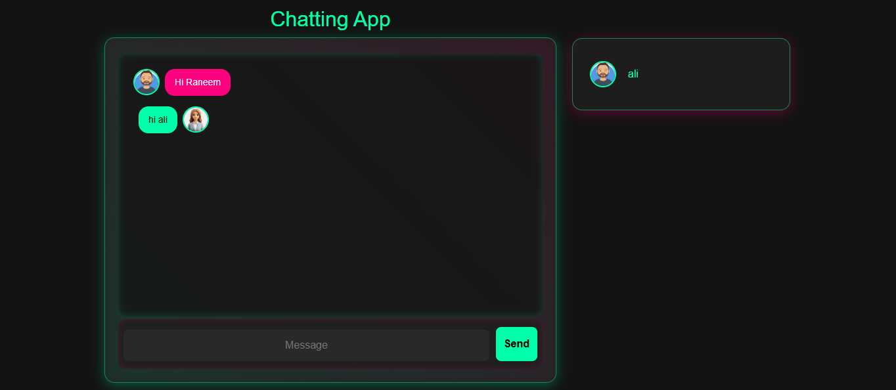

#  ChatApp Frontend - Real-time Chat Application

This is the frontend for the **ChatApp**, a real-time chat application with user authentication, including signup, login, email confirmation, and OTP verification.

##  Live Demo  
🔗 [ChatApp Demo](https://raneem-chat-app.netlify.app/)

##  Features  
-  User authentication (Signup, Login, Email Confirmation, OTP verification) 
-  Profile and cover image upload using **Multer and Cloudinary**
-  Responsive design using **Bootstrap 5** 
-  Secure Password Hashing  
-  Real-time Chatting  
-  API requests with **Axios**
-  Error handling and validation
-  Smooth OTP input with auto-focus


## Technologies Used

- **HTML5**
- **CSS3 & Bootstrap 5**
- **JavaScript (jQuery, Axios)**
- **Node.js & Express.js** (Backend API)

## Installation

1. Clone the repository:
   ```bash
   git clone https://github.com/raneemmagdy/ChatAppSocketFE.git
   ```
2. Navigate to the project folder:
   ```bash
   cd ChatAppSocketFE
   ```
3. Open `index.html` in your browser or use Live Server in VS Code.

## Usage

1. **Sign Up**: Create a new account by entering your details and uploading profile & cover images.
2. **Email Confirmation**: Enter the OTP sent to your email to verify your account.
3. **Login**: Access your account using email and password.
4. **Chat**: Once logged in, start chatting with other users.

## API Endpoints (Backend)

The frontend interacts with the following API endpoints hosted at:
```plaintext
https://chat-app-socket-be.vercel.app
```
- `POST /users/signup` - Register a new user
- `POST /users/signin` - Log in an existing user
- `PATCH /users/confirmEmail` - Verify OTP for email confirmation
- `POST /users/resendOtp` - Resend OTP

## Screenshots

### Login Page


### Signup Page


### Email Confirmation Page


### Chat Page



